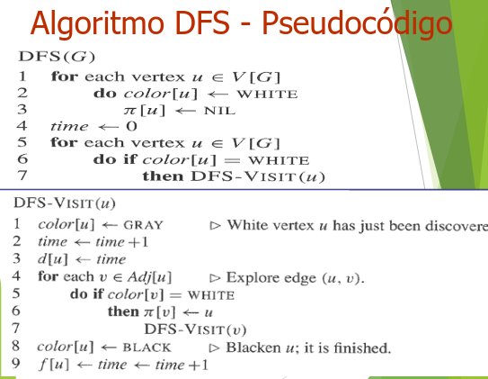
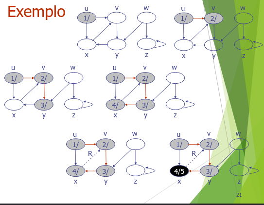
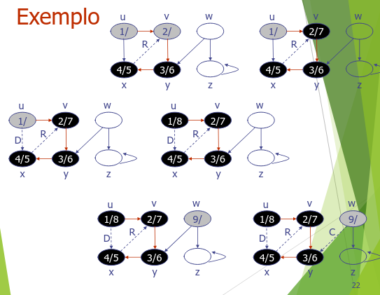
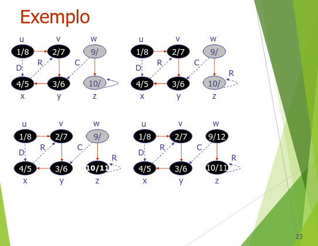

### Aplicação em grafos usando DFS

#### Implementação do grafo

- Lista de adjacência

#### Implementação do dfs

- Pseudocódigo do algoritmo BFS

#### Pseudocódigo e implementação




```java
 public void DFS(){
    for(Vertex u : this.vertex){
        if(u.color == Color.WHITE){
            DFS_VISIT(u);
        }
    }
    time = 0;
}
public void DFS_VISIT(Vertex u){
    u.color = Color.GRAY;
    time++;
    u.d = time;
    for(Vertex v : u.neighbors){
        if(v.color == Color.GRAY){ //EXTRA (PROCURANDO CICLO)
            System.out.println("Encontrado uma aresta de retorno no DFS!");
            System.out.println("["+u.name+"] -> ["+v.name+"]");
            System.out.println("Ciclo encontrado!");
        }
        if(v.color == Color.WHITE){
            v.parent = u;
            DFS_VISIT(v);
        }
    }
    u.color = Color.BLACK;
    time++;
    u.f = time;
}
```

#### Comportamento do algoritmo



- O algoritmo inicia procurando os primeiros vertices com `Color.WHITE`,
que na prática já iniciam todos brancos, pois não foram descobertos.
- No momento que ele é descoberto ao entrar no DFS_VISIT, sua cor passa a ser
`Color.GRAY`, o seu tempo de descoberto é definido do atual tempo incromentado: `time + 1`,
- A partir desse primeiro vértice, ele vai buscar por adjacêntes que estejam com `Color.WHITE`, ou seja,
não descobertos ainda. E ao encontrar algum, ele repete o processo recursivamente.
- Depois de percorrer até o fim, o algoritmo devolve recursivamente as chamadas feitas pelo DFS_VISIT.
- E ao sair da primeira chamada recursiva, ele finaliza aquele vertice setando `Color.BLACK` e definindo
o tempo de fechamento como sendo o tempo atual incrementado: `time + 1`.


